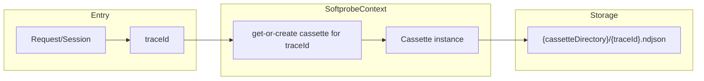

# Softprobe Cassette Design (NDJSON)

This document defines cassette responsibilities, lifecycle, and NDJSON behavior.

Related docs:
- [Main design](./design.md)
- [Context design](./design-context.md)

---

## 1) Goals

- Define a stable cassette interface for both capture and replay.
- Keep transport/storage behind one abstraction; call sites use only the Cassette interface.
- Keep NDJSON as the baseline storage format.
- Simplify lifecycle: no global cassette; one cassette per request/session, created only inside SoftprobeContext.

---

## 2) Configuration and Layout

- **Configure a cassette directory, not a file.** Config exposes `cassetteDirectory` (or equivalent). There is no single global cassette file path.
- **One NDJSON file per trace.** For a given traceId, the cassette file path is `{cassetteDirectory}/{traceId}.ndjson`. All records for that trace are stored in that single file.
- **Init does not create or set a global cassette.** Init reads config (mode, cassetteDirectory, strict flags) and stores only what is needed for context creation later (e.g. directory path and mode). No cassette instance is created at boot.

---

## 3) Cassette Lifecycle and Ownership

- **Cassette is created only when SoftprobeContext is created for a request/session.** Entry points (e.g. Express/Fastify middleware) do not construct cassette instances themselves. They invoke the path that creates or resolves the SoftprobeContext for that request; that path is responsible for getting or creating the cassette for the request’s traceId.
- **One cassette instance per traceId.** When SoftprobeContext is created or updated for a given traceId, the runtime gets or creates a single cassette for that traceId (backed by `{cassetteDirectory}/{traceId}.ndjson`). SoftprobeContext updates (e.g. `withData`, `fromHeaders`) must not create new cassette instances; they reuse the existing cassette for that traceId.
- **Only SoftprobeContext creates cassette instances.** No other code path (init, middleware, replay helpers) is allowed to instantiate the concrete cassette type (e.g. NdjsonCassette). All creation is encapsulated inside the SoftprobeContext creation/run flow. This avoids multiple creation modes (boot vs header vs global) and keeps a single source of truth.



---

## 4) Cassette Interface

**Cassette is a pure read/write storage abstraction.** It has no awareness of mode (CAPTURE, REPLAY, PASSTHROUGH). Mode is a SoftprobeContext/application concern; the context decides when to call load vs save based on mode. The cassette only reads and writes data.

```ts
export interface Cassette {
  /** Read all records for this trace (cassette instance is bound to a single traceId). */
  loadTrace(): Promise<SoftprobeCassetteRecord[]>;

  /** Append one record for this trace. */
  saveRecord(record: SoftprobeCassetteRecord): Promise<void>;

  /** Optional: flush pending writes (e.g. on request end or process exit). */
  flush?(): Promise<void>;
}
```

Design notes:
- Each cassette file holds only one traceId, so the interface does not take traceId: `loadTrace()` and `saveRecord(record)` are sufficient. The cassette instance is created for a specific traceId and is bound to that trace for its lifetime.
- Call sites must not depend on NDJSON or file layout; they use only this interface.
- The cassette does not know or care about mode; SoftprobeContext uses it for both capture (save) and replay (load) depending on the active mode.

---

## 5) NDJSON Record Model

```ts
export type SoftprobeCassetteRecord = {
  version: '4.1';
  traceId: string;
  spanId: string;
  parentSpanId?: string;
  spanName?: string;
  timestamp: string;

  type: 'inbound' | 'outbound' | 'metadata';
  protocol: 'http' | 'postgres' | 'redis' | 'amqp' | 'grpc';
  identifier: string;

  requestPayload?: unknown;
  responsePayload?: unknown;
  statusCode?: number;
  error?: { message: string; stack?: string };
};
```

Rules:
- One JSON object per line.
- Append-only writes.
- One file per trace; `loadTrace()` reads that file (no traceId parameter needed).

---

## 6) Capture Behavior (context, not cassette)

When the active context has `mode === 'CAPTURE'`, the application uses the context’s cassette to write. The cassette itself is mode-agnostic; it only exposes `saveRecord(record)`.

- Context provides `traceId` and `cassette` (created for this request’s traceId).
- Inbound and outbound hooks call `cassette.saveRecord(record)` (cassette from `SoftprobeContext.getCassette()`).
- Writes go directly to the cassette file (no in-process buffer). Optional `cassette.flush?.()` remains for future buffered implementations; the default adapter’s flush is a no-op.

---

## 7) Replay Behavior (context, not cassette)

When the active context has `mode === 'REPLAY'`, the application uses the context’s cassette to read. The cassette itself is mode-agnostic; it only exposes `loadTrace()`.

- Context provides `traceId` and `cassette` (created for this request’s traceId).
- `SoftprobeContext.run()` uses the context’s cassette and calls `cassette.loadTrace()` once per scoped run.
- Loaded records seed matcher state for wrappers/interceptors.

---

## 8) NDJSON Adapter (Implementation Detail)

The reference adapter is an NDJSON-backed implementation (e.g. NdjsonCassette) used only inside SoftprobeContext. It is pure storage: read and write only, with no concept of mode.

- Backed by a single file path derived from `cassetteDirectory` and `traceId`.
- Implements `loadTrace()` by reading that file.
- Implements `saveRecord(record)` by appending one NDJSON line directly to the file (no in-process buffer). Optimizations such as buffering can be added later.
- Exposes optional `flush()` as a no-op for the default direct-write implementation; the interface allows future implementations to use flush for draining a buffer.

This adapter is not constructed by init, middleware, or CLI directly; only the SoftprobeContext creation path instantiates it. NDJSON loading and file layout are implementation details behind the Cassette interface.

---

## 9) Tests

- **Getting a cassette in tests:** Tests that need to assert on cassette behavior should do so within a SoftprobeContext scope. Run the code under test inside `SoftprobeContext.run(options, fn)` (or the equivalent context creation path); inside the scope, use `SoftprobeContext.getCassette()` to obtain the cassette and assert on calls (e.g. mock or spy) or on side effects.
- **Asserting on file contents:** Tests that need to verify the contents of a cassette file (e.g. E2E) should use the known layout: after a run with a given traceId and cassetteDirectory, the file is at `{cassetteDirectory}/{traceId}.ndjson`. Tests can read that path directly for assertions, or the test harness may provide a small helper that, given directory and traceId, returns the records (without creating a new cassette instance in production code). The important rule is: production code never creates cassette instances outside SoftprobeContext; tests may need a controlled way to open/read the file for a given (directory, traceId) for assertion purposes only.
